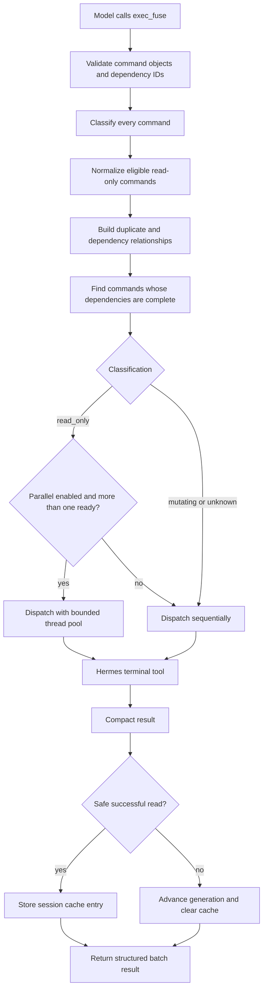

# Hermes Exec Fuse architecture

This document describes the design of Hermes Exec Fuse `0.1.x` and the safety boundaries that future changes must preserve.

## Goals

Hermes Exec Fuse is designed to:

1. reduce repeated foreground terminal calls;
2. combine independent inspections into one model tool call;
3. parallelize only commands that can be classified conservatively as read-only;
4. reuse exact safe results without serving stale workspace data after known mutations;
5. reduce terminal-result size deterministically;
6. preserve Hermes' own approval and execution pipeline.

## Non-goals

The current implementation does not attempt to:

- understand arbitrary shell semantics perfectly;
- prove that a command is side-effect free;
- execute commands outside Hermes' terminal tool;
- support interactive or background processes;
- persist command output across process restarts;
- infer semantic equivalence between different commands;
- replace Hermes' context engine or terminal implementation.

## Component map

```text
plugin.yaml
    └── declares tools and hooks

__init__.py
    ├── registers exec_fuse and exec_fuse_stats
    ├── injects a short per-turn efficiency rule
    ├── observes direct terminal calls
    └── invalidates cache after known mutation tools

schemas.py
    └── defines the LLM-facing tool contract

classifier.py
    ├── normalizes command whitespace
    └── classifies shell segments as read_only, mutating, or unknown

executor.py
    ├── validates command batches and dependencies
    ├── deduplicates normalized exact read-only commands
    ├── schedules ready commands
    ├── dispatches every real command through Hermes terminal
    └── returns compact structured results

state.py
    ├── stores session-scoped LRU cache entries
    ├── tracks workspace generations
    └── records execution and savings metrics

compressor.py
    └── deterministically reduces large strings and JSON-like results
```

## End-to-end flow



## Command classification

The classifier returns one of three values:

### `read_only`

A command is read-only only when all parsed shell segments are recognized as safe inspections. This category is eligible for:

- bounded parallel execution;
- session cache reuse;
- normalized exact duplicate elimination.

Examples include selected filesystem inspection commands, safe Git queries, linter checks without fixing, and test collection.

### `mutating`

A command is mutating when its executable or arguments indicate state changes. It:

- runs sequentially;
- is never cached or deduplicated;
- advances the workspace generation after execution.

### `unknown`

Unknown means the plugin cannot confidently prove the command is read-only. Unknown commands remain allowed, but receive the same scheduling and invalidation treatment as mutating commands.

This fail-closed classification is intentional. A false negative costs performance; a false positive can serve stale data or parallelize unsafe work.

## Shell composition

The classifier splits common shell operators and classifies each segment. A composed command is read-only only when every segment is read-only. Redirection, command substitution, unsafe quoting, or an unparseable segment causes conservative fallback.

A `cwd` supplied through `exec_fuse` is not inserted into the classifier input. It is separately included in cache identity and safely quoted when execution arguments are built.

## Scheduling and dependencies

Each command has a unique `id` and optional `depends_on` IDs.

The scheduler repeatedly:

1. finds pending commands whose dependencies already have results;
2. skips commands with failed dependencies;
3. resolves normalized duplicates after their canonical command completes;
4. runs ready read-only commands concurrently when allowed;
5. runs all mutating and unknown commands sequentially;
6. detects a dependency cycle when no pending command can become ready.

The read-only thread pool is capped at eight workers, even when a batch contains more eligible commands.

## Terminal dispatch boundary

The most important execution invariant is:

```python
ctx.dispatch_tool("terminal", terminal_args)
```

The plugin does not invoke `subprocess`, `os.system`, or a shell directly. This keeps execution inside Hermes' existing tool registry and preserves terminal backend selection, approval checks, credentials, redaction, timeout handling, and other host-owned behavior.

A thread-local flag marks internal dispatches so the plugin's own direct-terminal hooks do not recursively intercept commands launched by `exec_fuse`.

## Cache identity

A batch cache fingerprint is a SHA-256 hash of canonical JSON containing:

```text
normalized command
working directory
timeout-related options
workspace generation
```

Intra-batch duplicate identity uses the same fields without generation, because duplicates are resolved inside one active scheduler run.

Whitespace normalization deliberately remains shallow. The plugin does not rewrite quotes, reorder flags, resolve paths, or infer equivalent shell syntax.

## Cache scope and lifetime

Default state limits are:

| Setting | Value |
| --- | ---: |
| TTL | 300 seconds |
| Entries per session | 128 |
| Tracked sessions | 64 |

The state store uses an `RLock` and ordered dictionaries for thread-safe bounded LRU behavior.

Cache entries contain compact output and metadata only. The plugin does not keep an additional full-output archive.

## Workspace generations

Every session starts at generation zero. A known or possible mutation advances the generation and clears that session's cache.

Generation changes occur after:

- `exec_fuse` dispatches a mutating or unknown command;
- a direct terminal command is not classified as read-only;
- selected Hermes tools that may alter local state return, currently `write_file`, `patch`, `execute_code`, and `skill_manage`.

Generation is included in each cache fingerprint. Even without clearing entries, results from an older generation would not match a new lookup.

External changes performed outside the observed Hermes process cannot be detected automatically; the short TTL and per-command cache opt-out remain important safeguards.

## Direct terminal guard

The `pre_tool_call` hook observes ordinary foreground `terminal` calls. For a recognized read-only command, it computes the current fingerprint and checks the session cache.

When a match exists, the hook returns Hermes' supported block directive with a cache-hit marker and compact result. This avoids another terminal execution.

The hook cannot transparently substitute a successful tool result because the current plugin API exposes block-or-allow behavior at this lifecycle point. The marker lets the `post_tool_call` hook avoid treating the blocked response as a fresh execution.

The `post_tool_call` hook records new direct read-only results and invalidates the generation after other direct terminal commands.

## Output compaction

Compaction is deterministic and tokenizer-independent.

For oversized text, the plugin:

1. strips ANSI sequences;
2. keeps the first 24 lines;
3. selects up to 36 middle lines matching diagnostic keywords;
4. keeps the final 18 lines;
5. removes duplicate selected lines;
6. inserts a marker with original line and character counts;
7. applies a final character head/tail fallback when needed.

For JSON-like data, string values are compacted recursively and lists are capped at 100 items before the final result is rendered compactly.

## Failure semantics

A dispatched terminal result is currently considered failed when its returned dictionary or JSON object contains a truthy `error` field, or when dispatch raises an exception.

This is intentionally simple but backend-dependent. Future work should normalize exit-code and error semantics without bypassing host-owned terminal behavior.

Dependencies only proceed after a result with `ok: true`. With `fail_fast: true`, any failure also causes later otherwise-ready commands to be skipped.

## Metrics

Metrics are session-scoped and count:

- actual executions;
- cache hits;
- intra-batch duplicate hits;
- avoided calls;
- raw result characters observed;
- compact characters returned;
- estimated characters saved.

These are character counts, not exact tokens. They are intended for relative measurement and debugging.

## Design invariants for future changes

Changes should preserve all of the following:

1. Real commands always use Hermes tool dispatch.
2. Only positively recognized read-only commands may run concurrently or be cached.
3. Unknown behavior fails closed to sequential execution and invalidation.
4. Cache identity includes workspace generation.
5. Classifier changes include adversarial neighboring tests.
6. Output compaction remains deterministic and retains diagnostic evidence.
7. State remains bounded and thread-safe.
8. Hooks must not crash the agent loop.
